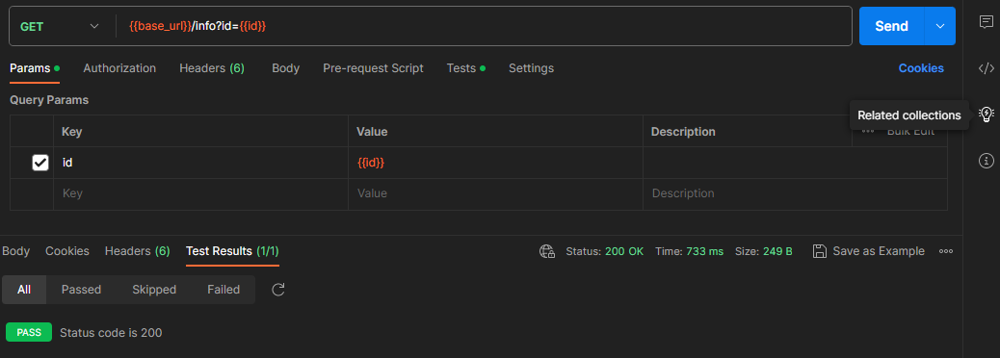
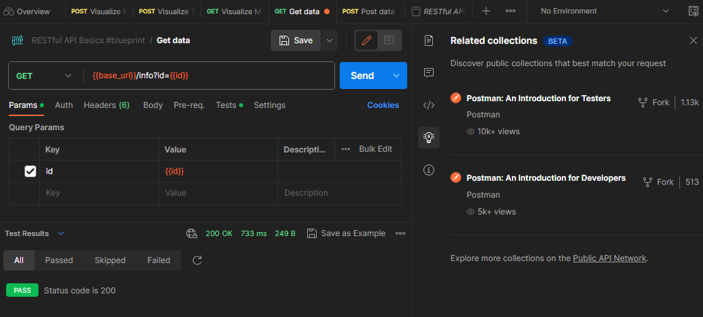
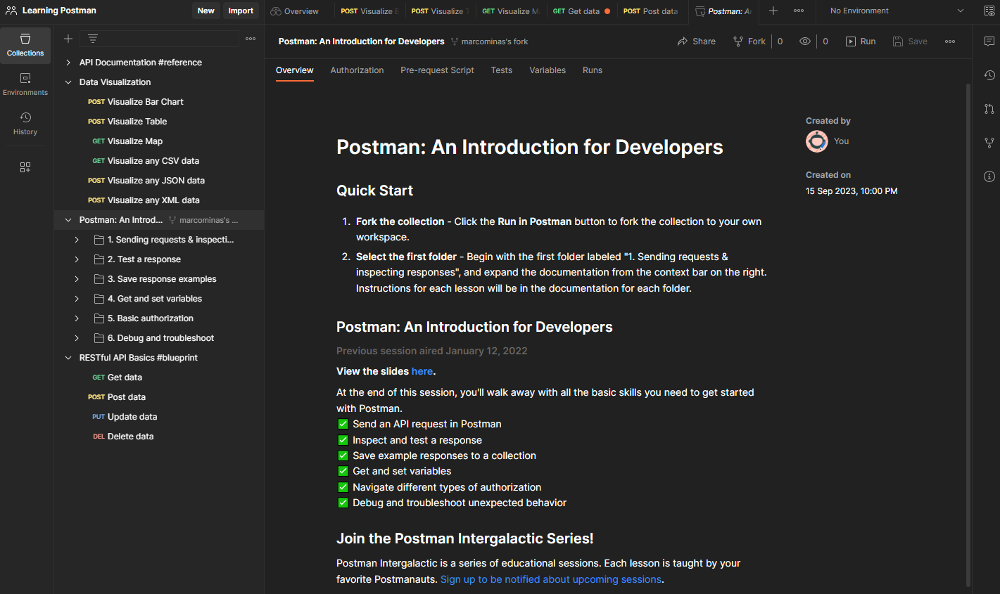
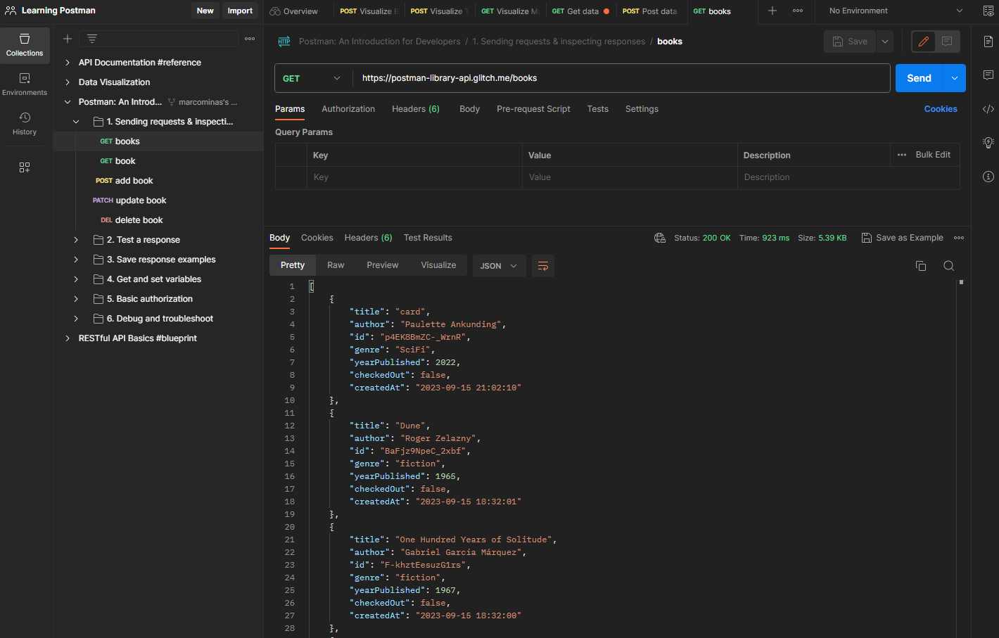
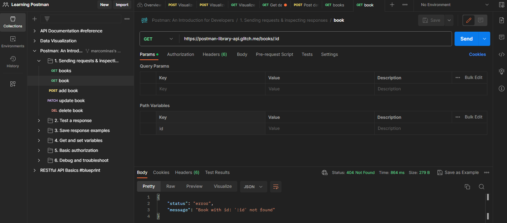
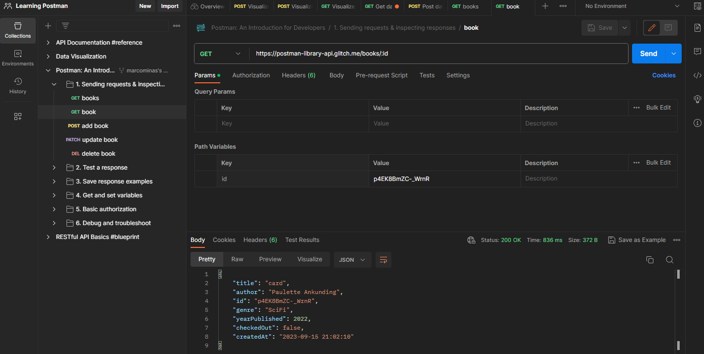

# Adding related collections on Workspace

When a request is select, on right corner is available a `lamp` button:

Click on it to see related collections to check other template collections:

Try click on `Fork` of `Postman: An Introduction for Developers` and fork it on Workspace - expetect result is:

Now, lets try `books` request of `1. Sending requests & inspecting responses` folder. Select it and click on `Send` button. It will looks like:

Now, let's try book request without pass book id:

Then, let's try book request with book id from books list:

