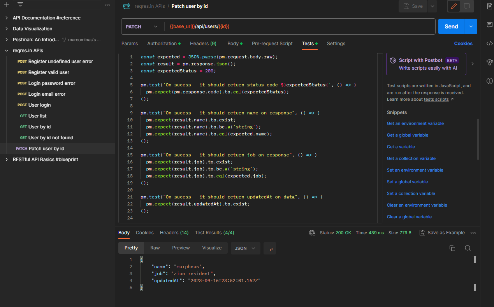

# Using reqres.in to explorer Postman resources

Let's use [reqres.in](https://reqres.in/) to create some requests with test.

## Patch user by id request

Create a PATCH request and set url to `{{base_url}}/api/users/{{id}}` - name it as `Patch user by id`

Set Authorization to Bearer Token and in Token use `{{token}}` tag to replace by token when subimit request.

Set request body to:

``` json
{
    "name": "morpheus",
    "job": "zion resident"
}
```

Set tests to:

``` javascript
const expected = JSON.parse(pm.request.body.raw);
const result = pm.response.json();
const expectedStatus = 200;

pm.test(`On sucess - it should return status code ${expectedStatus}`, () => {
  pm.expect(pm.response.code).to.eql(expectedStatus);
});

pm.test("On sucess - it should return name on response", () => {
  pm.expect(result.name).to.exist;
  pm.expect(result.name).to.be.a('string');
  pm.expect(result.name).to.eql(expected.name);
});

pm.test("On sucess - it should return job on response", () => {
  pm.expect(result.job).to.exist;
  pm.expect(result.job).to.be.a('string');
  pm.expect(result.job).to.eql(expected.job);
});

pm.test("On sucess - it should return updatedAt on data", () => {
  pm.expect(result.updatedAt).to.exist;
});
```

Run and check result. Expected response is:

``` json
{
    "name": "morpheus",
    "job": "zion resident",
    "updatedAt": "2023-09-16T23:49:03.144Z"
}
```

In this tests `const expected = JSON.parse(pm.request.body.raw);` get submited data to response validation.

Final expected result of this collection is something like this:


