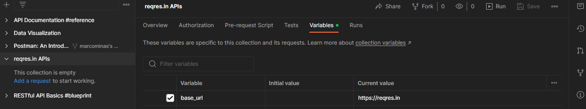

# Using reqres.in to explorer Postman resources

Let's use [reqres.in](https://reqres.in/) to create some requests with test.

First, create a new collection, name it to `reqres.in APIs` or something like this and add a `base_url` collection variable with `https://reqres.in` value.



## User registration and login

User registration requests:

 - [x] Register undefined user error request
 - [x] Register valid user

## Register undefined user error request

Create a POST request and set url to `{{base_url}}/api/register` - name it as `Register undefined user error`

Set request body to:

``` json
{
    "email": "marco.almeida@reqres.in",
    "password": "marco-vei"
}
```

Set tests to:

``` javascript
const expectedStatus = 400;
const result = pm.response.json();
const expectedError = "Note: Only defined users succeed registration";

pm.test(`On error - it should return status code ${expectedStatus}`, () => {
  pm.expect(pm.response.code).to.eql(expectedStatus);
});

pm.test("On error - it should return error on response", () => {
    pm.expect(result.error).to.exist;
});

pm.test("On error - it should return expected error", () => {
   pm.expect(result.error).to.be.a('string');
   pm.expect(result.error).to.eql(expectedError);
   pm.expect(result.error).to.have.lengthOf(expectedError.length);
});
```

Run and check result. Expected response is:

``` json
{
    "error": "Note: Only defined users succeed registration"
}
```

## Register valid user request

Duplicate previous request and change it's body to:

``` json
{
    "email": "eve.holt@reqres.in",
    "password": "marco-vei"
}
```

Set tests to:

``` javascript
const expectedToken = "QpwL5tke4Pnpja7X4";
const expectedStatus = 200;
const expectedId = 4;
const result = pm.response.json();

if (result.id) {
    pm.collectionVariables.set("id", result.id);
}

if (result.token) {
    pm.collectionVariables.set("token", result.token);
}

pm.test(`On sucess - it should return status code ${expectedStatus}`, () => {
  pm.expect(pm.response.code).to.eql(expectedStatus);
});

pm.test("On sucess - it should return id on response", () => {
    pm.expect(result.id).to.exist;
});

pm.test("On sucess - it should return expected id", () => {
   pm.expect(result.id).to.be.a('number');
   pm.expect(result.id).to.eql(expectedId);
});

pm.test("On sucess - it should return token on response", () => {
    pm.expect(result.token).to.exist;
});

pm.test("On sucess - it should return expected token", () => {
   pm.expect(result.token).to.be.a('string');
   pm.expect(result.token).to.eql(expectedToken);
});
```

Run and check result. Expected response is:

``` json
{
    "id": 4,
    "token": "QpwL5tke4Pnpja7X4"
}
```

Check if collection variable contains `id` with `4` as value and `token` equal to `QpwL5tke4Pnpja7X4`.

