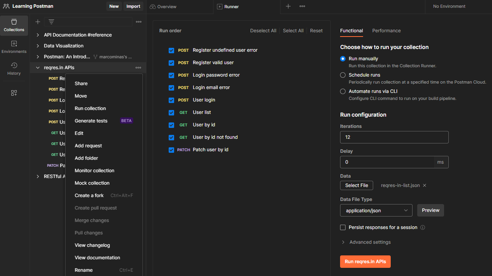
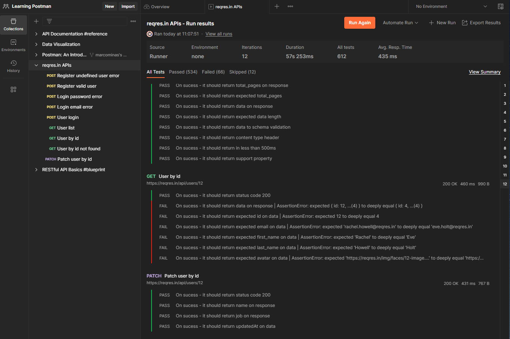
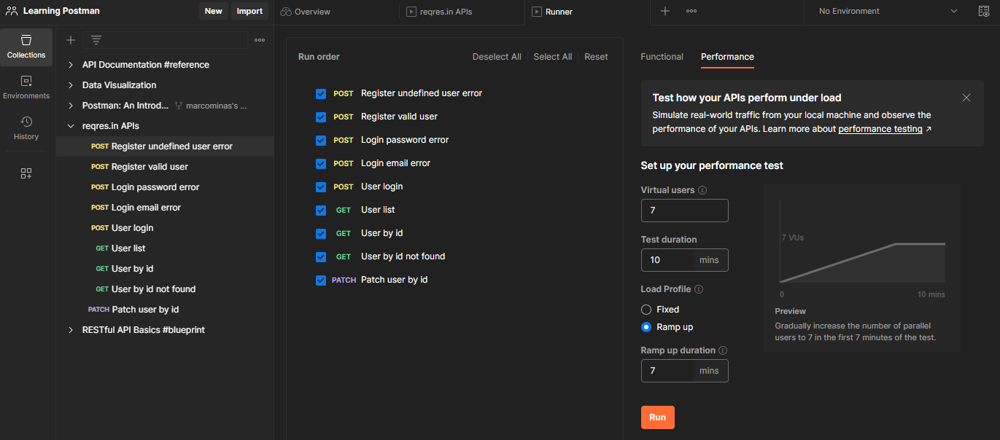
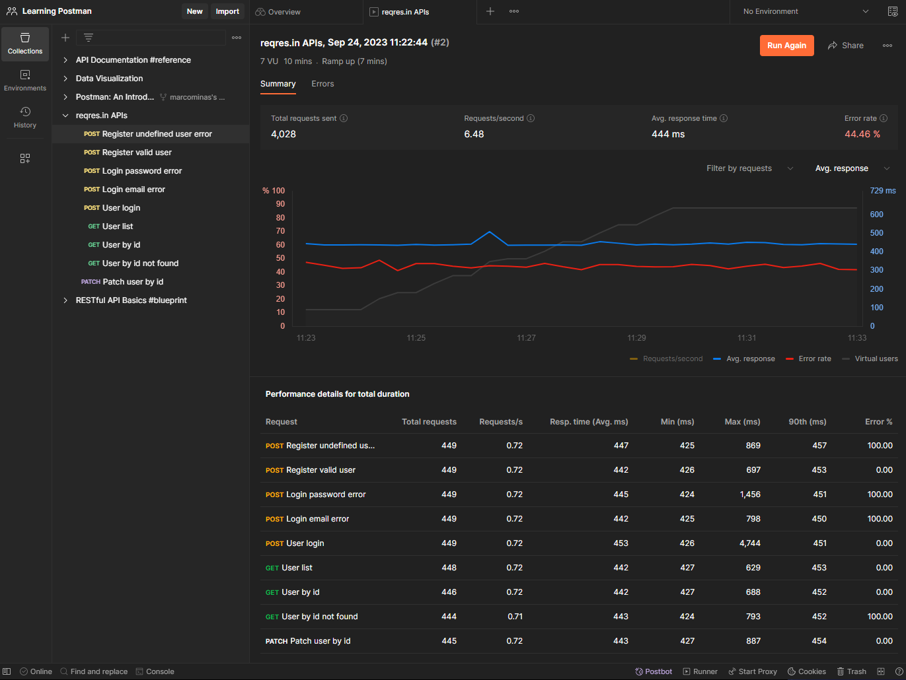
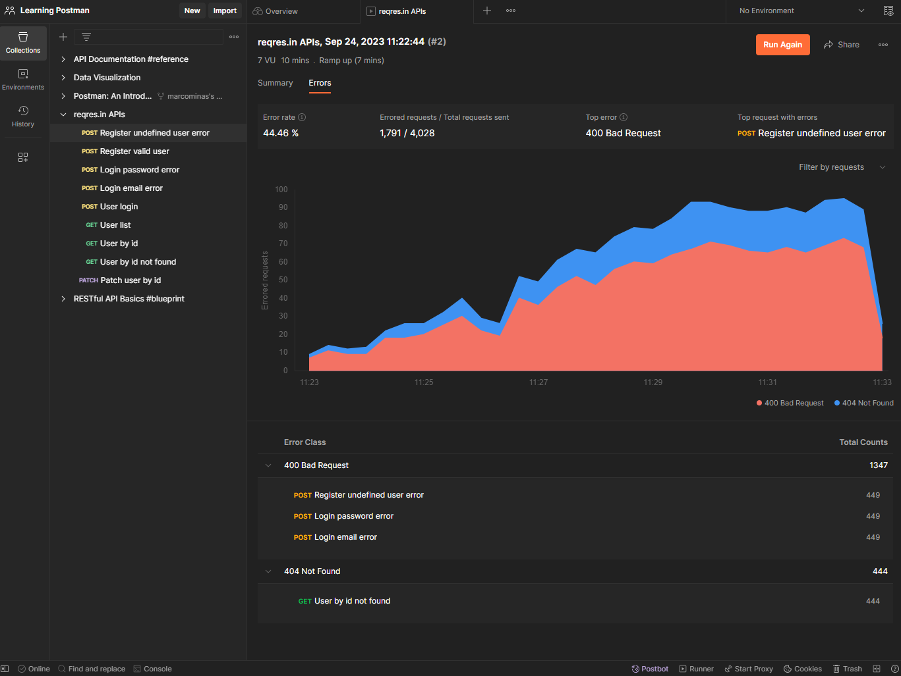
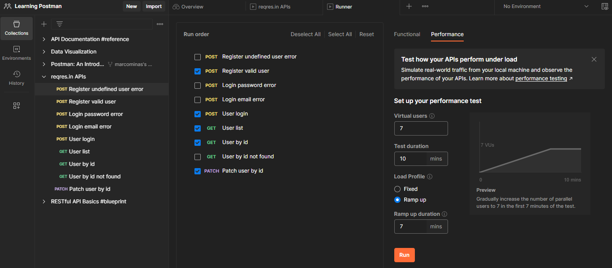
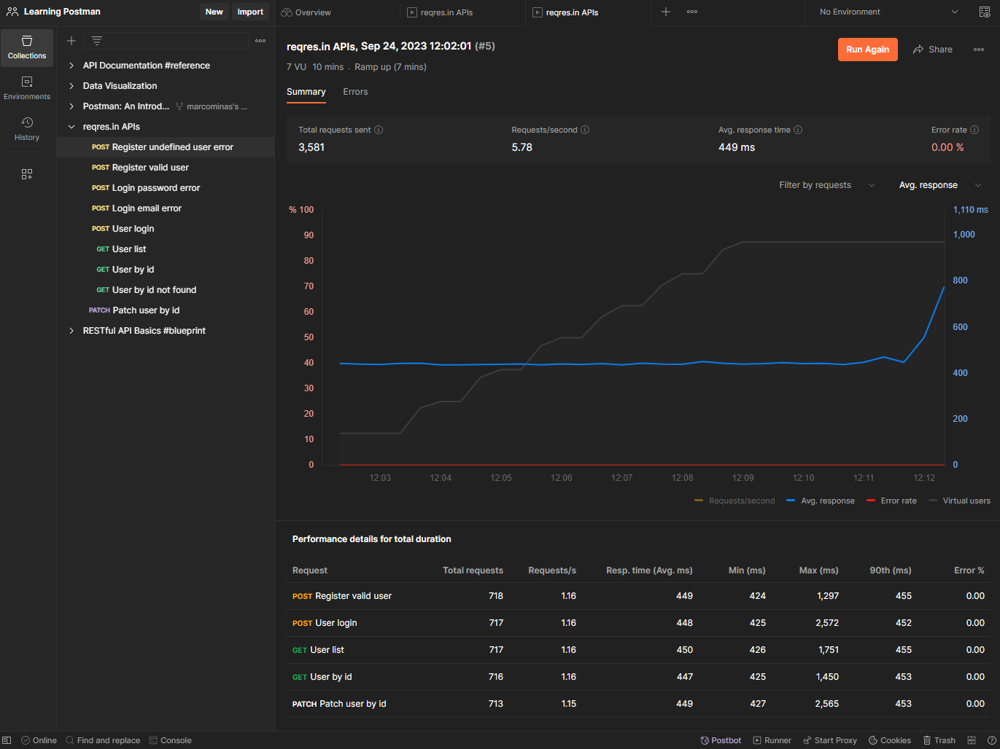

# Running reqres.in

There is mainly two running Postman ways: `Functional` and `Performance`.

## Functional

Functional runs can be done `manually`, `scheduled` or `via CLI` and can be configured with `iteractions`, `delay` and `data`. Let's try some.

### Manually with file

Step by step?

 * save [reqres-in-list.json](./reqres-in-list.json) locally.
 * right click on `...` menu found on left of collection name
 * click in `Select file` in `Data` configuration option
 * select [reqres-in-list.json](./reqres-in-list.json) saved locally
 * use `Preview` button to see file content items
 * click in `Run reqres.in APIs` button

Before execution it looks like:



After execution, expected result is that all tests executed 12 times, check `Iteractions` is set to `12`:



Some tests fails, it happened because expected values on GET `User by id` tests are hard coded to `Eve` data, so on `Eve` execution it succeed and on other ones will fail.

To fix, find this on `Tests` code block of `User by id` request:

``` javascript
const expected = {
  id: pm.collectionVariables.get("id"),
  email: "eve.holt@reqres.in",
  first_name: "Eve",
  last_name: "Holt",
  avatar: "https://reqres.in/img/faces/4-image.jpg"
};
```

And change it to:

``` javascript
const expected = {
  id: pm.variables.get('id'),
  email: pm.variables.get('email') || "eve.holt@reqres.in",
  first_name: pm.variables.get('first_name') || "Eve",
  last_name: pm.variables.get('last_name') || "Holt",
  avatar: pm.variables.get('avatar') || "https://reqres.in/img/faces/4-image.jpg"
};
```

This will pass loaded variable if value available or default value if not. Just adding `pm.variables.get('variable_name') || ` on properties declaration apply valid value when this tests run in a single `Send` button click or in a manual run execution with file.

## Improving `User by id` request tests

Put this on test code:

``` javascript
// variables validations if available
(pm.variables.get('id') === undefined ? pm.test.skip : pm.test)
    ('On sucess - it should return expected id on variables', () => {
      pm.expect(pm.variables.get('id')).to.be.a('number');
      pm.expect(pm.variables.get('id')).to.eql(expected.id);
});

(pm.variables.get('email') === undefined ? pm.test.skip : pm.test)
    ('On sucess - it should return expected email on variables', () => {
      pm.expect(pm.variables.get('email')).to.be.a('string');
      pm.expect(pm.variables.get('email')).to.eql(expected.email);
});

(pm.variables.get('first_name') === undefined ? pm.test.skip : pm.test)
    ('On sucess - it should return expected first_name on variables', () => {
      pm.expect(pm.variables.get('first_name')).to.be.a('string');
      pm.expect(pm.variables.get('first_name')).to.eql(expected.first_name);
});

(pm.variables.get('last_name') === undefined ? pm.test.skip : pm.test)
    ('On sucess - it should return expected last_name on variables', () => {
      pm.expect(pm.variables.get('last_name')).to.be.a('string');
      pm.expect(pm.variables.get('last_name')).to.eql(expected.last_name);
});

(pm.variables.get('avatar') === undefined ? pm.test.skip : pm.test)
    ('On sucess - it should return expected avatar on variables', () => {
      pm.expect(pm.variables.get('avatar')).to.be.a('string');
      pm.expect(pm.variables.get('avatar')).to.eql(expected.avatar);
});
```

Run test clicking `Send` button and then with a manual run execution with file.

Expected is that on `Send` button click this tests will be ignored except `id` variable validation on manual execution. The `pm.variables.get('id')` will return value from `pm.collectionVariables.get('id')` on `Send` click execution or from `pm.variables.get('id')` on manual execution with file.

## Performance

Postman comes with performance test tool, try run with this settings:

 * Virtual Users: 7
 * Test duration: 10 mins
 * Ramp up
 * Ramp up duration: 7



Results looks like this:



And errors results looks like:



The problem is that this errors are false negatives - performance test checks http status result to evaluate what pass or not and we have some tests wrote to fail. Try again unselecting this:

 * Register undefined user error
 * Login password error
 * Login email error
 * User by id not found



Result looks like?



And here is a [exporting to PDF report](./run_collection_performance_v2_report.pdf) sample.
