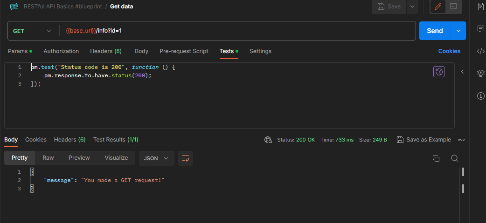
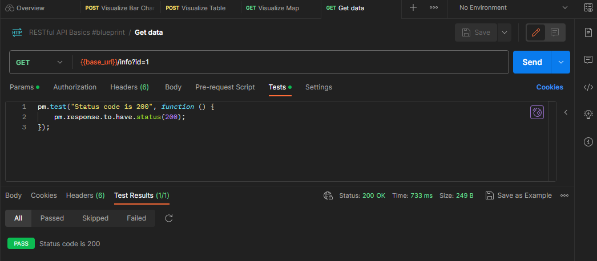
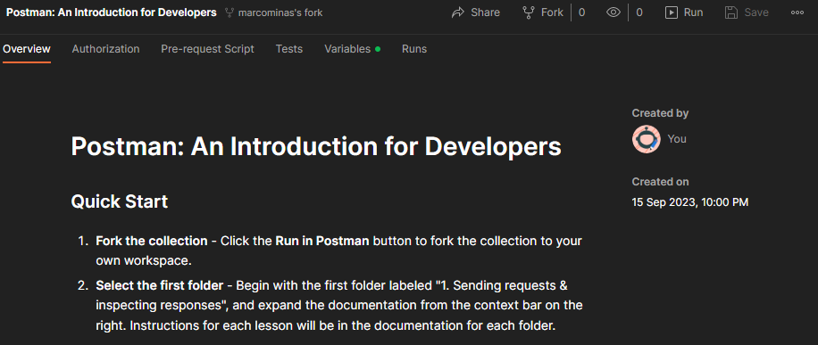
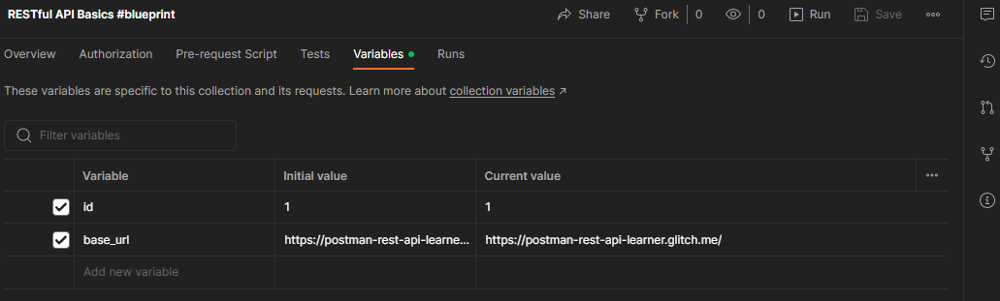
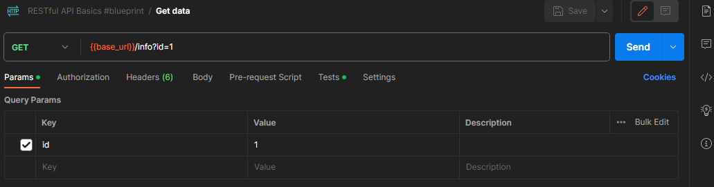
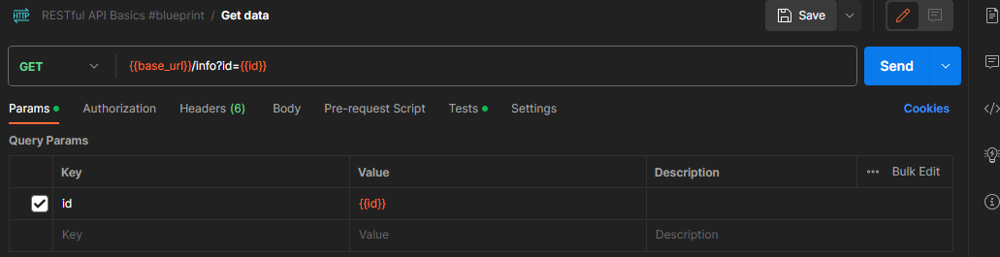

# Using RESTful API Basics #blueprint collection

Now let's try other collection - click on `Get data` request of `RESTful API Basics #blueprint` collection.

Check `Tests` tab to see what will be validated and click on `Send` button.

Result looks like this:

To see test results click on `Test results` on response area:

This test check if response status is equals to 200 as excpected.

Now try `Post data` and check expected result that could be 200 or 201 status.

But wait... all url use this format: `{{base_url}}/info?id=1` - what is this `{{base_url}}` on requests url?

Its a `collection variable` - to see this, click on `RESTful API Basics #blueprint` on collections list and a collection overview will appear. This section have some tabs: `Overview`, `Authorization`, `Pre-request Script`, `Tests`, `Variables` and `Run` options.

Click on `Variables` tab and you'll see:

Now we see that `base_url` is set to `https://postman-rest-api-learner.glitch.me/` this value replace `{{base_url}}` tags on collection requests. This variable is available to this specifc collection.

We have `id` variable on this collection too. Lets change `Get data` to use it. Click on `Get data` request, click on `Param` and replace `1` fixed value to `{{id}}` tag.

Change this:

To this:

Advantage of variable use is that any request using `{{id}}` tag replace value when `id` is changed on `Variable` collection tab.
