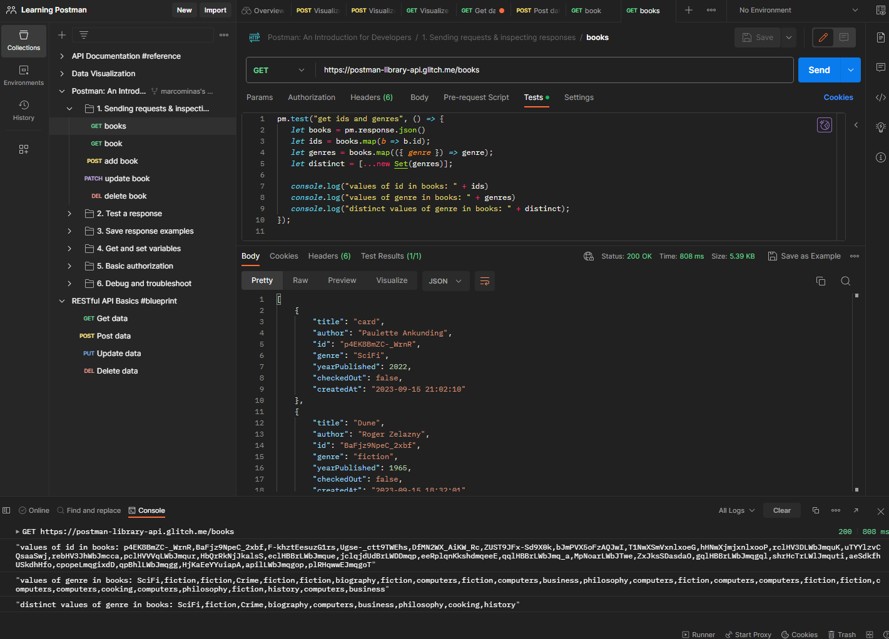

# Creating tests with books requests

Based on [How to Test JSON Properties in Postman](https://blog.postman.com/how-to-test-json-properties-in-postman/) let's change books requests.

Try copy and paste this test and check test result running it:

``` javascript
pm.test("get id and genre books", () => {
   let books = pm.response.json();
   let ids = books.map(b => b.id);
   let genres = books.map(({ genre }) => genre);
   let distinct = [...new Set(genres)];

   console.log("values of id in books: " + ids)
   console.log("values of genre in books: " + genres)
   console.log("distinct values of genre in books: " + distinct);
});
```

Expected result is something like this:



Now let's try this one:

``` javascript
pm.test("get book by title", () => {
   let books = pm.response.json()
   let book = books.find(b => {
       return b.title === 'card'
   })

   pm.collectionVariables.set("id", book.id);
   console.log(book)
});
```


Check if `id` is on collection variables after run test.

If `get book by title` test fails, check book title on find collection query, line 16 on test panel.

Now that `{{id}}` variable is filled by find book on list we can change other requests to use it. So we will change them.
