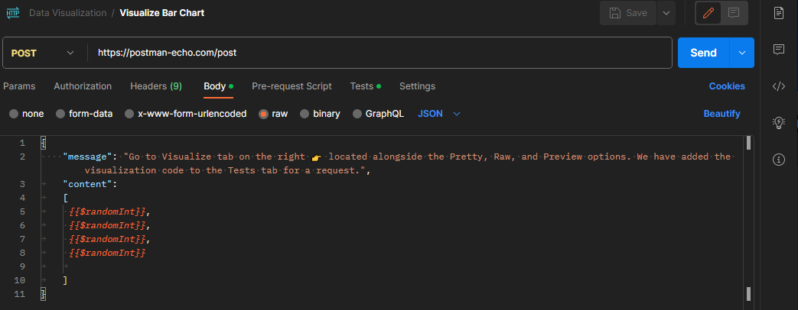
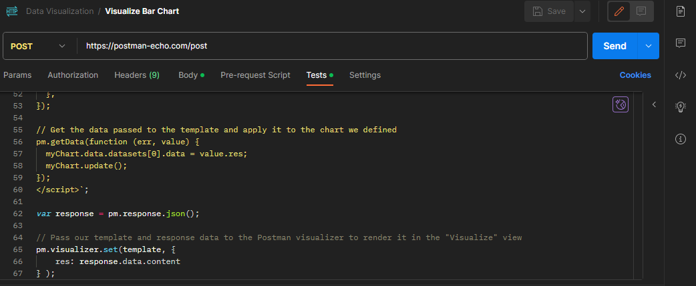
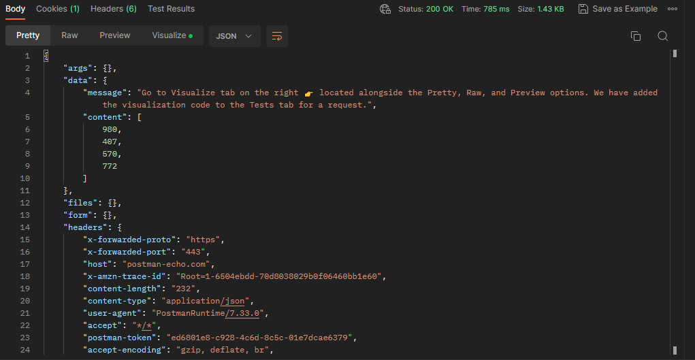
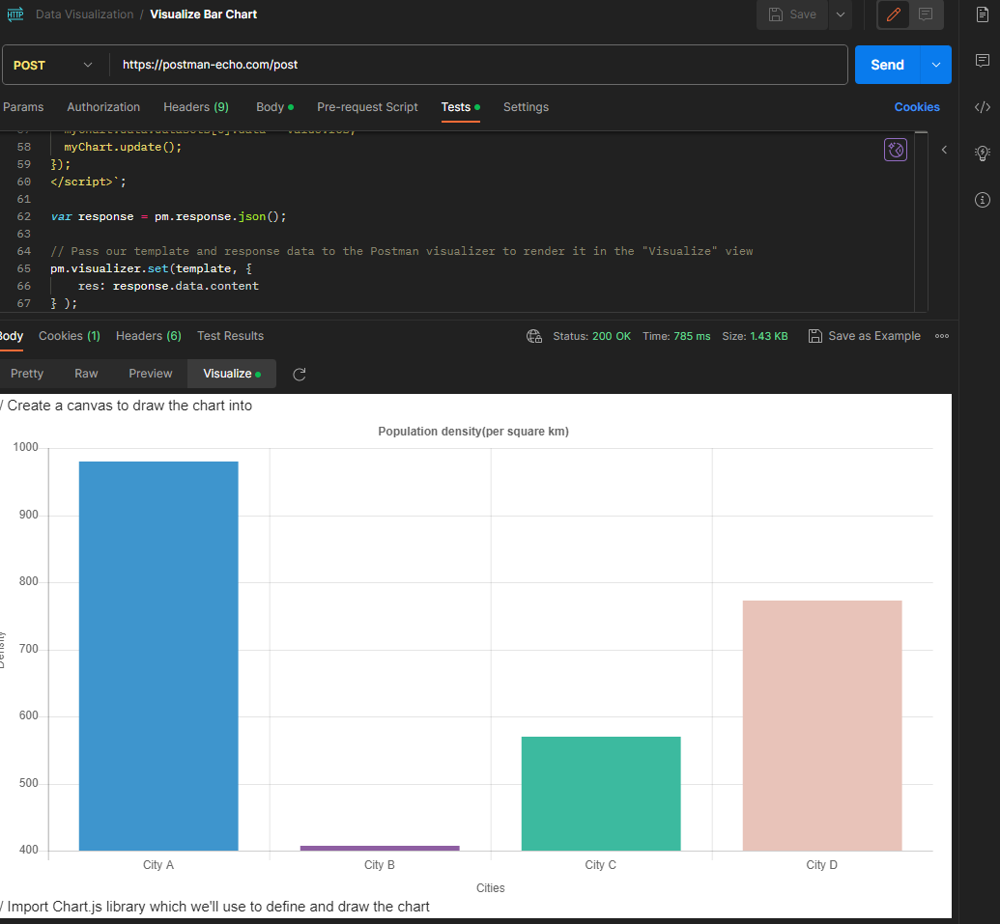

# Using Data Visualization collection

Let's explore Data Visualization collection for now.

Click on `Visualize Bar Chart` request and click on `Body` request to check what will be sent.

Body use `{{$randomInt}}` that is one of some [Dynamic variables](https://learning.postman.com/docs/writing-scripts/script-references/variables-list/) Postman resource.

Now click on `Tests` to check how visualization is configured. It looks like this:

At the end we find visualizer command `pm.visualizer.set( ... );` that contains two parameters: visualization template and visualization data.

Now click on `Send` button to get data response:

Response will be presented on `Pretty` default format.

Click on `Visualize` button to see visualization mode. Result looks like this:

Expected result is a chart with city A, B, C and D bars.

Now, let's check `Visualize Table` and `Visualize Map` to check other visualization options.
