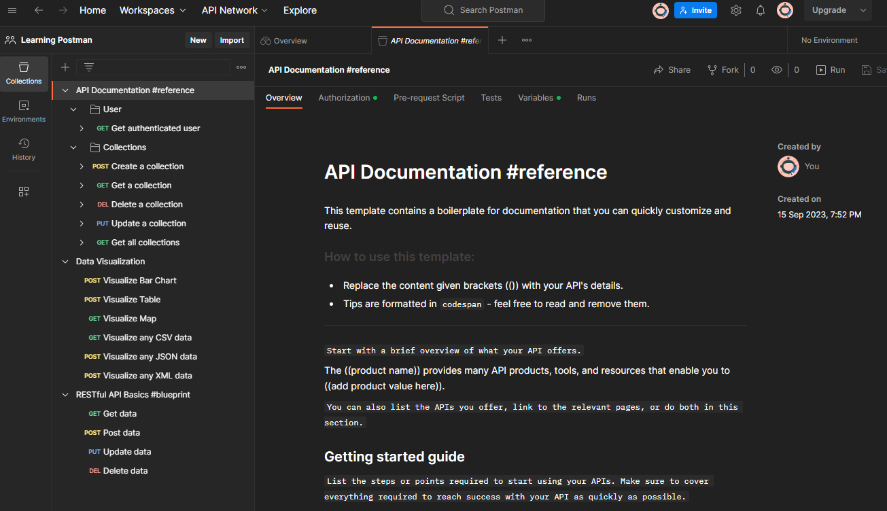

# Creating a Workspace

Let's start creating a Workspace tho our learning plan. Follow this steps:

 * click on menu available on top left Postman corner
 * select `File` -> `New` -> `Workspace`
 * choose `API demos` on `Explorer our templates` so we will not start from zero
 * click on `Next` and fill `Name` and `Summary` - suggestion: "Learning Postman"
 * leave `Team` as `Who can access your workspace` and click on `Create` buttom

At this time, `API demos` will create this collections:

 * collection `API Documentation #reference`
 * collection `Data Visualization`
 * collection `RESTful API Basics #blueprint`

Workspace will looks like:

API Documentation #reference collection need API key creation and configuration to works, so we will skip it for simplicity.
